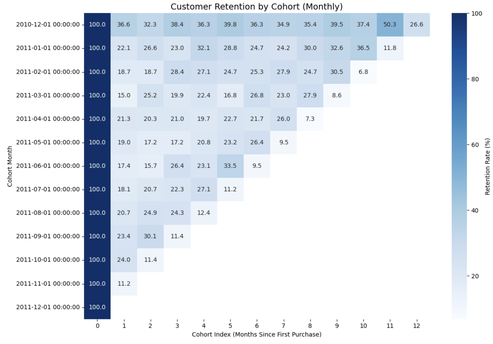

# From Transaction to Insights: Cohort Analysis of Online Retail
## 📌 Introduction
This project analyzes the Online Retail dataset (UCI Machine Learning Repository), which includes 541,909 transactions from a UK-based online gift retailer between December 2010 and December 2011. The dataset captures invoice-level details such as product, quantity, unit price, date, customer ID, and country.

* Our main objectives were to:
1. Assess data quality and prepare the dataset for analysis.
2. Measure business performance via revenue, orders, and customer KPIs.
3. Apply RFM segmentation to classify customer behavior.
4. Conduct cohort analysis to understand customer retention trends.

## 🛠 Tools & Environment
* **SQL**: PostgreSQL
* **IDE**: Visual Studio Code
* **Version Control**: Git, GitHub
* **Visualization & Storytelling**: Python, Notion (for non-technical presentation)

→ Python Visualization Code: [Python Visualization Code](/ecommerce_analysis/6_visualization.py)

## 🔍 Summary of Analysis
**1. Data Quality & Preparation**
* Missing values:
    * Description: 1,454 nulls
    * Customer ID: 135,080 nulls (~25% of datset)
* Negative values: 10,624 transactions with negative quantity (returns)
* Cancelled invoices: 9,288
* Revenue lost due to invalid or unknown transactions: £1,447,682.12

Data cleaning rules applied:
* Exclude transations with negative or zero quantity.
* Exclude transations with zero or negative price.
* Remove cancelled invoices.
* Keep only transactions with valid CustomerID for customer-level analysis.

→ After cleaning, we retained valid transactions only, ensuring customer behavior metrics.

**2. Revenue Contribution**
* Total Revenue (baseline): £10,666,684.54
* Revenue from unknown customers: £1,755,276.64 (16.46%)
* Revenue from valid known customers: £8,911,408

→ Almost 1 in 6 pounds in sales is unattributable to a customer due to missing IDs, which limits behavioral tracking.

**3. Business KPIs**
* Unique Customers (with valid IDs): 4,338
* Distinct Orders: 19,960 (~4.6 orders per customer on average)
* Top Product by Quantity: Paper Craft, Little Birdie (80,995 units sold)

|           Description              |   Total Sold    |
|------------------------------------|-----------------|
| PAPER CRAFT , LITTLE BIRDIE        | 80,995          |
| MEDIUM CERAMIC TOP STORAGE JAR     | 78,033          |
| WORLD WAR 2 GLIDERS ASSTD DESIGNS  | 55,047          |
| JUMBO BAG RED RETROSPOT            | 48,474          |
| WHITE HANGING HEART T-LIGHT HOLDER | 37,891          |
| POPCORN HOLDER                     | 36,761          |
| ASSORTED COLOUR BIRD ORNAMENT      | 36,461          |
| PACK OF 72 RETROSPOT CAKE CASES    | 36,419          |
| RABBIT NIGHT LIGHT                 | 30,788          |
| MINI PAINT SET VINTAGE             | 26,633          |

* Revenue by Country:
    * UK dominates with 84.6% of revenue (£9.0M)
    * Other markets: Netherlands, Ireland, Germany, France

|          Country          |       Revenue       |
|---------------------------|---------------------|
| United Kingdom            | 9,025,222.08        |
| Netherlands               | 285,446.34          |
| EIRE (Ireland)            | 283,453.96          |
| Germany                   | 228,867.14          |
| France                    | 209715.11           |
| Australia                 | 138,521.31          |
| Spain                     | 61,577.11           |
| Switzerland               | 57,089.90           |
| Belgium                   | 41,196.34           |
| Sweden                    | 38,378.33           |

* Monthly Trends:
    * Peak in Nov 2011 (£1.51M, Christmas shopping)
    * Sharp decline in Dec 2011 (£693K, post-holiday drop)

|         Month         |         Revenue        |
|-----------------------|------------------------|
| 2010-12-01            | 823,746.14             |
| 2011-01-01            | 691,364.56             |
| 2011-02-01            | 523,631.89             |
| 2011-03-01            | 717,639.36             |
| 2011-04-01            | 537,808.62             |
| 2011-05-01            | 770,536.02             |
| 2011-06-01            | 761,739.90             |
| 2011-07-01            | 719,221.19             |
| 2011-08-01            | 759,138.38.            |
| 2011-09-01            | 1,058,590.17           |
| 2011-10-01            | 1,154,979.30           |
| 2011-11-01            | 1,509,496.33           |
| 2011-12-01            | 638,792.68             |

→ The business is UK-centric, gift-driven, and seasonal.

**4. Customer Segmentation (RFM Analysis)**

Using Recency, Frequency, and Monetary (RFM) segmentation:

|         Customer Segmentation Graph        |
|--------------------------------------------|
|       |

* Others (~83% of customers, 3,600+)
    * Mixed behavior; collectively drive ~£7.9M (~89% of revenue).
* Loyal Customers (~7%, 295 customers)
    * Generate £548K (6.15%). Strong retention potential.
* Big Spenders (~4%, 157 customers)
    * Contribute £349K (3.9%). Candidates for premium offers.
* At Risk (~6%, 276 customers)
    * £65K revenue. These customers are disengaging.
* Champions (<1%, 5 customers)
    * £22K revenue. Niche but valuable for referrals or VIP programs.

→ The broad middle tier of customers is most critical, not just high-value champions.

**5. Customer Retention (Cohort Analysis)**

Cohorts were defined by first purchase month. Retention rates were calculated as the % of customers in a cohort making repeat purchases in subsequent months.

|          Customer Retention Heatmap        |
|--------------------------------------------|
|                     |

* Month 0 retention - 100% (by definition).
* Sharp drop-off after Month 1 (most customers don't return).
* Retention stabilizes at low single digits after Month 6.
* Holiday cohorts (e.g., Nov-Dec) show weaker retention than organically acquired cohorts.

Take the Jaunary 2011 cohort as an example:
* Month 0: By definition, retention is 100% - all customers made at least one purchase in Jaunary.
* Month 1: Around 45% of those January customers made another purchase in February.
* Month 2: Retention drops further, with only 30% of the original cohort making a purchase in March.
* Month 4: By April, just 12% of that cohort is still active.
* Month 6: By June, only 5% of the original Jaunary buyers are still making purchases.

→ This pattern demonstrates the classic retention curve in e-commerce: a steep early decline followed by a long, low plateau. Most customers churn quickly, but a small subset remains active long term.

## 📈 Conclusion
The analysis shows that while the business generated over £10M in revenue, a significant portion (16%) comes from transactions without identifiable customers, limiting insight into behavior. The revenue base is heavily UK-centric and seasonally concentrated around holiday peaks, with limited international penetration.

Customer segmentation reveals that revenue is driven not by a small group of champions but by a broad base of everyday buyers who collectively contribute nearly 90% of sales. This middle tier should be the focus of retention and upselling campaigns, while smaller but valuable segments such as loyal customers and big spenders present opportunities for tailored marketing.

Cohort analysis highlights the challenge of retention, with sharp drop-offs after the first purchase month and stabilization at very low levels thereafter. This underscores the importance of onboarding and engagement strategies within the first two months of a customer’s lifecycle. Improving customer data capture, strengthening early retention, and designing loyalty strategies beyond seasonal spikes will be critical for long-term growth and customer lifetime value.

### References
* Dataset: Online Retail (UCI Repository)